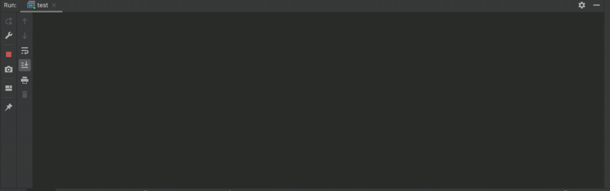
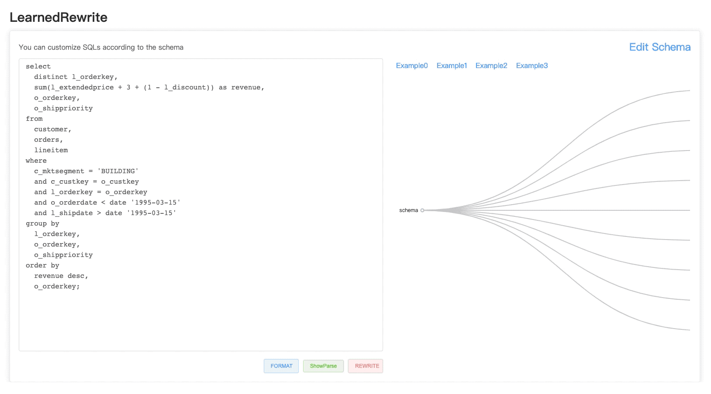

<div align="center">

**A Demo of SQL Rewrite.**

------

<p align="center">
  <a href="#Overview">Overview</a> •
  <a href="#Installation">Installation</a> •
  <a href="#Datasets">Datasets</a> •
  <a href="#Issues">Issues</a> •
  <a href="#Citation">Citation</a> •
</p>

</div>


## What's New?

- July 2023: We add 100+ new rules to enhance the rewrite capability 

  *by zhaoyan and jianming in the [single-rule](https://github.com/zhouxh19/LearnedRewrite/tree/single-rule) branch*

- June 2023: Our demo is accepted in VLDB 2023

- May 2022: First Commit


## Overview

**evolveRewrite**  is a learned SQL transformation tool, which takes as input a SQL query and corresponding statistics (e.g., schema, #-table rows), finds the optimal rewrite sequence and outputs an optimized rewritten query. Currently *evolveRewrite* is developled based on [Calcite](https://github.com/apache/calcite).


<div align="center">


</div>

## Installation

**Note: 仅需要安装JAVA环境就可运行项目，早期的JDK版本在Calcite上有编码问题，所以建议使用JDK11以上版本。 点击查看[安装文档](https://www.oracle.com/java/technologies/downloads/#java11)**


## What Can You Do via evolveRewrite?

*Code Usage*

* 可在Interllij IDEA等IDE中直接运行test。
* 当前测试数据基于TPCH,如需修改为其它测试数据可修改```src/main/schema.json```中json格式的schema
* 修改```src/test```文件中的testSql进行语句测试



*Use Api*

项目中带了HttpServer,可直接运行```nohup /root/jdk-15/bin/java -jar {{输入项目路径}}/rewriter_java.jar --server.port=6336 &```，端口为**6336**
* api: /rewriter POST {sql: "select....", schema: {....}}



## Datasets

For the online version, we support datasets with different legal schema. By default we adopt TPC-H schema in *evolveRewrite*.

## Issues
Major improvement/enhancement in future.

* add custom rules
* update the RA2SQL script (e.g., avoiding useless changes from the origin SQL)
* support cost models of mainstream databases
* verify rewriting equivalence 
* add more rewriting information in the front-end pages
* test under more real scenarios (welcome to contact us:))


## Citation
Please cite our paper if you use SQL-Rewriter in your work

```bibtex
@article{DBLP:journals/pvldb/ZhouLCF21,
  author    = {Xuanhe Zhou and
               Guoliang Li and
               Chengliang Chai and
               Jianhua Feng},
  title     = {A Learned Query Rewrite System using Monte Carlo Tree Search},
  journal   = {Proc. {VLDB} Endow.},
  volume    = {15},
  number    = {1},
  pages     = {46--58},
  year      = {2021},
}
```

```bibtex
@article{demovldb2023,
  author    = {Xuanhe Zhou and
               Guoliang Li and
               Jianming Wu and
               Jiesi Liu and
               Zhaoyan Sun and
               Xinning Zhang},
  title     = {A Learned Query Rewrite System},
  journal   = {Proc. {VLDB} Endow.},
  year      = {2023},
}
```

We thank all the  contributors to this project, more contributors are welcome!
